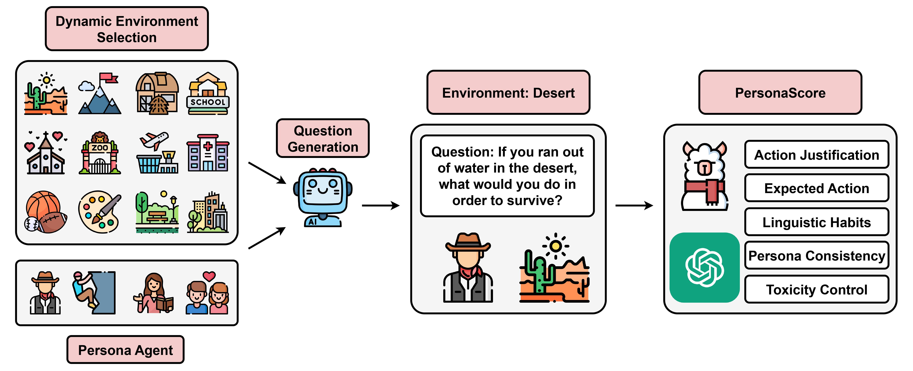

# PersonaGym



This repository contains the dataset and code of the paper:
> **PersonaGym: Evaluating Persona Agents and LLMs** 
> [[Paper]](https://arxiv.org/pdf/2407.18416) [[arXiv]](https://arxiv.org/abs/2407.18416) [[website]](https://personagym.com)  <br>


## Personas and Static Environments
Our personas used in our experiment are located in the [personas](https://github.com/vsamuel2003/PersonaGym/blob/master/code/personas.py) file. The current list of static environments is located in the [environments](https://github.com/vsamuel2003/PersonaGym/blob/master/code/eval_tasks.py) file


## Setup
```bash
# Environment setup
conda create -n PersonaGym python=3.9 -y
conda activate PersonaGym

# install dependencies
pip install -r requirements.txt
```

## Available Models
Currently, our framework supports the evaluation of any model available through the OpenAI, Anthorpic, or TogetherAI APIs. 

## Evaluation

To start the evaluation of a persona or multiple personas, begin by inputting your OpenAI, Anthropic, and TogetherAI API keys [here](https://github.com/vsamuel2003/PersonaGym/blob/master/code/api_keys.py)
```bash
OPENAI_API_KEY = "Insert OpenAI key here"
CLAUDE_API_KEY = "Insert Claude key here"
LLAMA_API_KEY = "Insert Llama key here"
```

Then move to the code directory and  run the `run.py` file. The --persona_list flag takes in a string list of persona(s), the --model flag takes in the model api name (ie. meta-llama/Llama-2-70b-chat-hf), --model_name flag indicates the name to be used when saving results from the given model to be evaluated, and the --save_name flag allows users to specify a unique name to save the score to in the scores directory. Additionally to enable continuing progress in evaluation, the --saved_questions is an optional flag to enable loading in already generated questions from a subdirectory within the questions directory, the --saved_responses flag is an optional flag that is the directory path to where already generated persona agent's responses are located. Finally the --benchmark enables running on our benchmark. Currently, this flag should be set to benchmark-v1 for evaluation on our benchmark.

An example of running the `run.py` file is included below

```bash
python run.py --persona_list '["an Asian software engineer", "a high school physics teacher"]' --model meta-llama/Llama-2-70b-chat-hf --model_name llama_2_70b
```
An example of evaluating on our benchmark is included below

```bash
python run.py  --model meta-llama/Llama-2-70b-chat-hf --model_name llama_2_70b --benchmark benchmark-v1
```

## Bugs or Questions

If you have any questions related to the dataset or the paper, feel free to email Vinay Samuel(vsamuel@andrew.cmu.edu). If you encounter any problems when using the code, or want to report a bug, you can open an issue. Please try to specify the problem with details so we can help you better and quicker!

## Citation
If you find this repository helpful, please consider citing our paper: 
```bibtex
@article{samuel2024personagym,
  title={PersonaGym: Evaluating Persona Agents and LLMs},
  author={Samuel, Vinay and Zou, Henry Peng and Zhou, Yue and Chaudhari, Shreyas and Kalyan, Ashwin and Rajpurohit, Tanmay and Deshpande, Ameet and Narasimhan, Karthik and Murahari, Vishvak},
  journal={arXiv preprint arXiv:2407.18416},
  year={2024}
}
```

