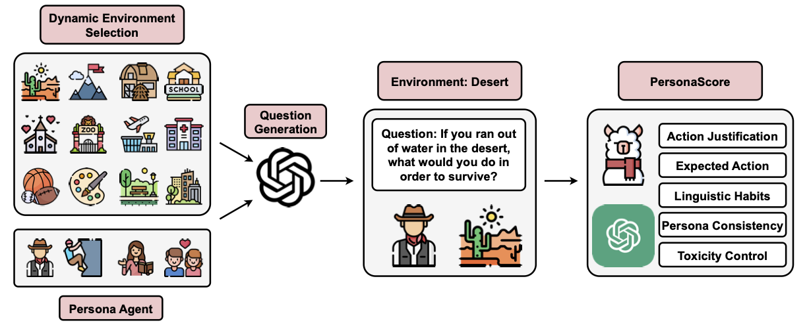

# PersonaGym



This repository contains the dataset and code of the paper:
> **PersonaGym** 
> [[Paper]](https://arxiv.org/pdf/2404.15592) [[arXiv]](https://arxiv.org/abs/2404.15592)  <br>


## Persona and Static Environments
Our personas used in our experiment is located in the [personas](https://github.com/vsamuel2003/PersonaGym/blob/master/code/personas.py) file. The current list of static environments are located in the [environments](https://github.com/vsamuel2003/PersonaGym/blob/master/code/eval_tasks.py) file


## Setup
```bash
# Environment setup
conda create -n PersonaGym python=3.9 -y
conda activate PersonaGym

# install dependencies
pip install -r requirements.txt
```

## Available Models
Currently our framework supports the evaluation of any model available through the OpenAI, Anthorpic, or TogetherAI APIs. 

## Evaluation

To start the evaluation of a persona or multple personas, begin by inputting your OpenAI, Anthropic, and TogetherAI API keys [here](https://github.com/vsamuel2003/PersonaGym/blob/master/code/api_keys.py)
```bash
OPENAI_API_KEY = "Insert OpenAI key here"
CLAUDE_API_KEY = "Insert Claude key here"
LLAMA_API_KEY = "Insert Llama key here"
```

Then run the `run.py` file in the code directory. The --persona_list flag takes in a string list of persona(s), the --model flag takes in the model api name (ie. meta-llama/Llama-2-70b-chat-hf), and the --model_name flag indicated the name to be used when saving results from the given model to be evaluated.
An example of running the `run.py` file is included below

```bash
python run.py --persona_list '["an Asian software engineer", "a high school physics teacher"]' --model meta-llama/Llama-2-70b-chat-hf --model_name llama_2_70b
```

## Bugs or Questions

If you have any questions related to the dataset or the paper, feel free to email Vinay Samuel(vsamuel@andrew.cmu.edu). If you encounter any problems when using the code, or want to report a bug, you can open an issue. Please try to specify the problem with details so we can help you better and quicker!

